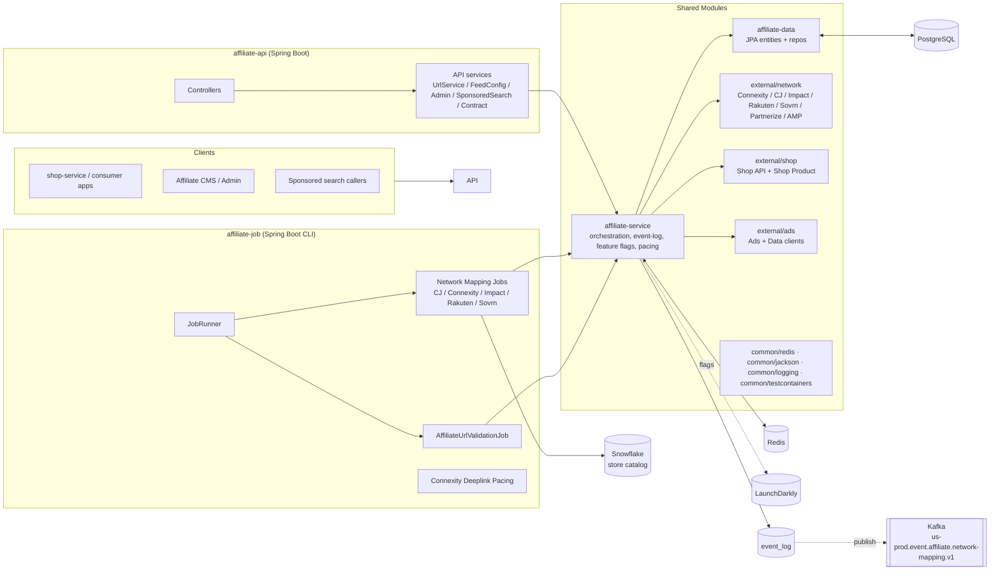
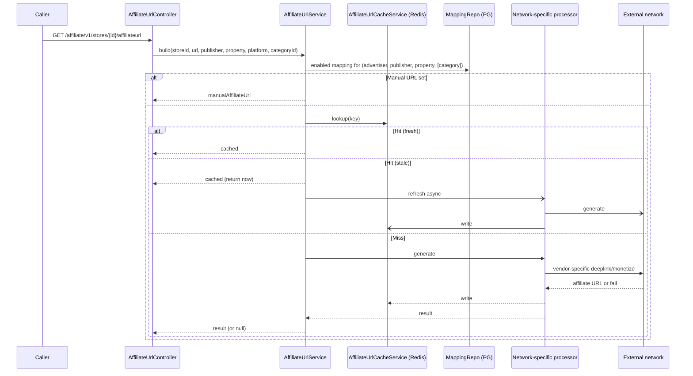

# Affiliate Service — Design Document

**Owner:** Block MarTech (`#block-martech-server-oncall`)
**Repo:** `squareup/affiliate-service`
**Last reviewed:** 2026-05-06
**Audience:** new contributors, on-call engineers, product partners, reviewers of architecture changes

This document is the single high-level design reference for the `affiliate-service` repo. It complements (and references) the topic-specific docs in [`knowledge-base/`](knowledge-base/) and the AI memory bank in [`ai-memory/`](ai-memory/). When the two disagree, prefer the source code; this document captures the design intent and the cross-cutting rules.

---

## 1. Purpose & Scope

### 1.1 Problem statement

Afterpay/Block surfaces (Cash App, Afterpay app, Afterpay shop) need to monetize outbound merchant traffic via affiliate networks. Each network exposes a different API, different identifiers, different URL-generation semantics, different feed semantics, and different operational quirks.

Without a central layer:
- callers (shop service, app clients, sponsored search) would each have to integrate 10+ networks
- mappings would drift (network changes ≠ local config)
- affiliate URLs would silently break and bleed revenue
- there is no consistent audit trail of changes

### 1.2 What this service is

`affiliate-service` is the **affiliate control plane** for Block. It is responsible for:

1. **Affiliate URL generation** — given a `(storeId, destinationUrl, publisher, property, platform)`, return the affiliate-tracked URL or `null`.
2. **Advertiser↔network mapping management** — admin/config CRUD over which networks are active for an advertiser, with per-property and per-category granularity.
3. **Feed configuration** — managing which feed source delivers product/deal data per advertiser, and triggering syncs.
4. **Sponsored search** — public read endpoint returning sponsored merchants for a query, mixing local + live network results.
5. **Contract retrieval** — normalized contract metadata (rates, terms, dates) per advertiser across networks.
6. **Auto-enrollment & maintenance jobs** — background sync of network membership, store↔merchant matching, and URL validation/auto-disable.
7. **Event log** — durable change record (Avro payloads in Postgres) feeding Kafka downstream consumers.

### 1.3 What this service is **not**

- Not a network proxy — callers do not pass through to vendor APIs.
- Not a click/conversion tracker — those live in upstream/downstream systems.
- Not a CMS — the CMS is the human-facing admin surface; this service is the API that the CMS calls.
- Not a payment/financial system — no money movement happens here.

### 1.4 Success metrics (KPIs)

- **Affiliate URL availability** — % of eligible store requests that get a non-null affiliate URL.
- **Affiliate URL freshness** — fraction of cached URLs validated by the URL-validation job.
- **Sponsored search coverage** — % of queries that return ≥1 result.
- **Mapping coverage** — % of eligible advertisers with at least one enabled mapping per supported property.
- **API SLO** — see Datadog SLO `service:ap-affiliate-api`.

---

## 2. High-Level Architecture

### 2.1 Two runnable applications, one shared codebase



The two runtimes (`affiliate-api` and `affiliate-job`) deliberately have very different runtime profiles (sync request/response vs. long-running batch with vendor pacing), but share business logic via `affiliate-service` + `affiliate-data` + `external/*`.

### 2.2 Module map

| Module | Type | Purpose |
|---|---|---|
| [`affiliate-api`](affiliate-api/) | runnable | HTTP controllers, security, OpenAPI config, request validation, API-layer services |
| [`affiliate-job`](affiliate-job/) | runnable | CLI-driven background jobs (mapping sync + URL validation) |
| [`affiliate-service`](affiliate-service/) | library | Cross-cutting business logic: event log, feature flags, network services, pacing, observability, advertiser/store loaders |
| [`affiliate-data`](affiliate-data/) | library | JPA entities, enums (`Publisher`, `Property`, `Platform`, `Country`, `NetworkEnum`), Spring Data repositories |
| [`external/network`](external/network/) | library | Vendor clients: AMP, Connexity, CJ, Impact, Partnerize (legacy spelling `Partnereize`), Rakuten, Sovrn |
| [`external/shop`](external/shop/) | library | Shop API + Shop Product Service Feign clients |
| [`external/ads`](external/ads/) | library | Ads API + Data Service (EPC) Feign clients |
| `common/redis` | library | Redis connection + serialization + cache helpers |
| `common/jackson` | library | Jackson configuration, custom (de)serializers |
| `common/logging` | library | Structured/JSON logging + MDC + perf-logging aspects |
| `common/testcontainers` | library | Shared Postgres/Redis Testcontainers fixtures |
| [`database`](database/) | infra | Flyway migrations + seed data + Docker assets |
| [`infra`](infra/) | infra | Kubernetes manifests for API + jobs (CronJobs), ECR scripts |

Authoritative module list: [`settings.gradle`](settings.gradle).

### 2.3 Layered dependency rule

```
affiliate-api ─┐
               ├─► affiliate-service ─► affiliate-data ─► (Postgres)
affiliate-job ─┘                  └────► external/* ──► (vendor APIs)
                                  └────► common/redis ► (Redis)
```

Controllers must not call repositories or external clients directly; they go through API-layer services in `affiliate-api/.../service` which delegate into `affiliate-service/.../services`. Job runners must not reimplement business logic; they reuse `affiliate-service` orchestrators (e.g. `NetworkMappingService` lives in the job module but composes `affiliate-service` building blocks).

---

## 3. Domain Model & Terminology

### 3.1 Core axes

Everything in the system is a function of these axes — a small change can affect many code paths:

| Axis | Values | Source |
|---|---|---|
| **Publisher** | `CASH_APP`, `AP` (Afterpay) | [`Publisher.kt`](affiliate-data/src/main/kotlin/com/afterpay/affiliate/data/model/Publisher.kt) |
| **Property** | `SHOPPING`, `ORGANIC_SEARCH`, `CATEGORY`, `SPONSORED_SEARCH`, `SPONSORED_PRODUCT_SEARCH`, `BOOST` | [`Property.kt`](affiliate-data/src/main/kotlin/com/afterpay/affiliate/data/model/Property.kt) |
| **Platform** | `APP`, `WEB`, `UNKNOWN` | [`Platform.kt`](affiliate-data/src/main/kotlin/com/afterpay/affiliate/data/model/Platform.kt) |
| **Country** | `US`, `AU`, `UK`, `NZ` | [`Country.kt`](affiliate-data/src/main/kotlin/com/afterpay/affiliate/data/model/Country.kt) |
| **Network** | 18 entries (see below) | [`NetworkEnum.kt`](affiliate-data/src/main/kotlin/com/afterpay/affiliate/data/model/NetworkEnum.kt) |

### 3.2 Affiliate networks

Master list (id, code, display name) from `NetworkEnum` and seed data in [`V1.0__Baseline.sql`](database/migrations/V1.0__Baseline.sql):

| ID | Code | Display name | Online? | Job sync? | Sponsored search? | URL gen? |
|---|---|---|---|---|---|---|
| 1 | `Connexity` | Connexity | ✅ | ✅ (`ConnexityNetworkMappingJob`) | ✅ | ✅ (deeplink, paced) |
| 2 | `AWIN` | Affiliate Window | manual only | — | — | manual URL |
| 3 | `CJ` | Commission Junction | ✅ | ✅ | — | ✅ |
| 4 | `Impact` | Impact | ✅ | ✅ | — | ✅ |
| 5 | `Pepperjam` | Pepperjam Ascend | manual only | — | — | manual URL |
| 6 | `Rakuten` | Rakuten Linkshare | ✅ | ✅ | — | ✅ |
| 7 | `Partnerize` | Partnerize *(code: `Partnereize`)* | ✅ | — | — | tracking-link API |
| 8 | `Sovrn` | Sovrn Viglink | ✅ | ✅ | — | ✅ (URL monetization) |
| 9 | `Shareasale` | Shareasale | manual only | — | — | manual URL |
| 10 | `AMP` | Ad Marketplace | ✅ | — | ✅ | — |
| 11–18 | various | AvantLink, Criteo, AdMedia, Intango, Commission Factory, eBay Partner Network, Slice Digital, TradeDoubler | mostly manual | — | varies | varies |

> Sponsored-search networks are country-dependent; supported subset includes AMP, Connexity, Shopnomix, Booking.

### 3.3 Glossary

- **Advertiser** — Block-side identifier representing a merchant in the Ads system. The mapping unit (`advertiser_id`) for all affiliate config.
- **Store** — Block-side store record (Snowflake-backed in jobs, Shop-API-backed in API). One advertiser may correspond to multiple stores; matching happens by domain.
- **Network merchant** — vendor-side merchant identity (e.g., Connexity merchant ID). Stored in `network_merchants` and joined to a mapping.
- **Mapping** — row in `advertiser_affiliate_network_mapping` linking `(advertiser_id, network_id, property)` with toggles, manual URL, and an optional category.
- **Manual URL override** — operator-supplied affiliate URL on the mapping; takes precedence over the network handler.
- **Auto URL** — affiliate URL generated by the network-specific handler, written into Redis cache.
- **Property** — traffic context (shopping vs. organic search vs. category vs. sponsored search). Different properties have different uniqueness rules.
- **Publisher** — destination surface (`CASH_APP` vs. `AP`). Different publishers have different default platform behavior.
- **Platform** — request channel (`APP` / `WEB` / `UNKNOWN`). Some stores are app-only.
- **Feed config** — advertiser-scoped record describing where product/deal data comes from (CJ, Sovrn, Impact, Partnerize, etc.) and the feed identifier on that side.
- **Sponsored search** — public, country-aware search returning sponsored merchants for a query, with bidding when multiple networks return results.
- **Event log** — `event_log` table storing serialized Avro payloads (mapping change events) plus topic metadata, consumed by a downstream publisher to Kafka.
- **Single-use payment (SUP)** — flag on merchants surfaced via `/affiliate/v1/merchant/{networkMerchantId}`.
- **EPC** — Earnings Per Click; Data Service supplies historical EPC used by sponsored-search bidding.
- **fmtc_id** — FMTC-tracked merchant identifier on the mapping (legacy column on `advertiser_affiliate_network_mapping`).

### 3.4 Naming gotchas (keep as-is)

- `Partnereize` — misspelled package and class names for Partnerize; preserve when navigating.
- `database.snowfalke.*` properties — typo preserved in config keys for Snowflake credentials.

---

## 4. Data Model

### 4.1 Core tables

| Table | Entity | Purpose |
|---|---|---|
| `affiliate_networks` | [`AffiliateNetwork`](affiliate-data/src/main/kotlin/com/afterpay/affiliate/data/model/AffiliateNetwork.kt) | Master network list (`id`, `name`); seeded by `V1.0` |
| `advertiser_affiliate_network_mapping` | [`AdvertiserAffiliateNetworkMapping`](affiliate-data/src/main/kotlin/com/afterpay/affiliate/data/model/AdvertiserAffiliateNetworkMapping.kt) | The central config row |
| `advertiser_affiliate_network_category_mapping` | [`AdvertiserAffiliateNetworkCategoryMapping`](affiliate-data/src/main/kotlin/com/afterpay/affiliate/data/model/AdvertiserAffiliateNetworkCategoryMapping.kt) | Optional 1:1 satellite holding `category_id` for `CATEGORY` mappings |
| `network_merchants` | [`NetworkMerchant`](affiliate-data/src/main/kotlin/com/afterpay/affiliate/data/model/NetworkMerchant.kt) | Vendor-side merchant identity, FK to mapping |
| `event_log` | [`EventLog`](affiliate-data/src/main/kotlin/com/afterpay/affiliate/data/model/EventLog.kt) | Avro payloads + Kafka topic metadata for downstream publication |

### 4.2 `advertiser_affiliate_network_mapping` schema

```text
id                     SERIAL PK
network_id             INT FK → affiliate_networks(id)
advertiser_id          INT
property               VARCHAR(64)   default 'SHOPPING'
affiliate_url_enabled  BOOLEAN
feed_enabled           BOOLEAN
affiliate_url          VARCHAR(50000)        -- widened in V4
fmtc_id                BIGINT
create_at              TIMESTAMP
create_by              VARCHAR(64)
last_update_at         TIMESTAMP             -- @UpdateTimestamp
last_update_by         VARCHAR(64)
```

Children (`networkMerchants` `OneToMany`, `categoryMapping` `OneToOne`) are **eager-fetched and cascaded**. Mutations to the collection use the custom setter that re-parents children to the owning mapping.

### 4.3 Schema evolution (Flyway)

Versioned scripts in [`database/migrations`](database/migrations):

| Version | Change | Why it matters |
|---|---|---|
| V1.0 | Baseline: `affiliate_networks`, `advertiser_affiliate_network_mapping`, `network_merchants`; seed 10 networks; UK on `(network_id, advertiser_id)` | Original constraint blocked multi-property setups |
| V2.0 | Add `property` column to mapping | Enabled property-aware uniqueness (`SHOPPING` vs `ORGANIC_SEARCH` vs `CATEGORY`) |
| V3.0 | Add `event_log` | Event-driven outbox for Kafka |
| V4.0 | `affiliate_url` widened to `VARCHAR(50000)` | Some networks emit very long affiliate URLs |
| V5.0 | `advertiser_affiliate_network_category_mapping` | Category-level mapping for `Property.CATEGORY` |
| V6.0 | Drop the V1.0 unique index | The original `(network_id, advertiser_id)` UK was incompatible with multi-property mappings |
| V7.0 | Add index on `last_update_at` | Powers the URL-validation job's recent-rows query |

### 4.4 Repository conventions

`affiliate-data/.../repository` exposes Spring Data JPA repos. Notable custom queries:

- `findRecentWithUrl(...)` — used by the URL-validation runner; selects mappings updated within the last 30 minutes for `SHOPPING` and `SPONSORED_SEARCH`, with non-blank `affiliateUrl`. (Renamed from `findRecentNonJobUpdatedWithUrl` in 2025-09; the `lastUpdateBy <> 'affiliate-job'` filter was removed.)
- Property/category-aware lookups for admin listing.
- Mapping lookups for URL generation (by store → advertiser → mapping).

### 4.5 Caches (Redis)

The Redis cache is **part of correctness**, not just performance.

| Cache | Owner | Key shape | Lifetime |
|---|---|---|---|
| Affiliate URL cache | [`AffiliateUrlCacheService`](affiliate-api/src/main/kotlin/com/afterpay/affiliate/api/service/AffiliateUrlCacheService.kt) | `(storeId, publisher, destinationUrl, …)` | TTL + async refresh on stale read |
| Advertiser/networks lookup | [`AdvertiserNetworksCacheService`](affiliate-api/src/main/kotlin/com/afterpay/affiliate/api/service/AdvertiserNetworksCacheService.kt) | per advertiser | invalidated on mapping mutate |
| Sponsored-search advertisers | [`SponsoredSearchAdvertisersCacheService`](affiliate-api/src/main/kotlin/com/afterpay/affiliate/api/service/sponsoredsearch/SponsoredSearchAdvertisersCacheService.kt) | per `(country, productSearch?)` | warmed periodically |
| Stores snapshot | `StoresLoader` (job side) | per country | per-job-run |
| Network merchant snapshots | per-network loader | per network | per-job-run |
| Partnerize mapping data | feed flow | per advertiser | TTL |

**Stale-cache behavior is load-bearing for incremental sync** — incremental jobs detect inserts/updates/deletes by diffing the previous run's snapshot against the current pull. Changing snapshot semantics changes job behavior.

---

## 5. API Design

`affiliate-api` exposes three URL spaces with different security postures.

### 5.1 Authentication & authorization

Configured in [`WebSecurityConfiguration.kt`](affiliate-api/src/main/kotlin/com/afterpay/affiliate/api/configuration/WebSecurityConfiguration.kt). Basic auth, in-memory users:

| URL pattern | Required role | Notes |
|---|---|---|
| `/affiliate/**` | `AFFILIATE` or `ADMIN` | Internal callers (shop service etc.) |
| `/admin/**` | `ADMIN` | CMS-only; advertiser context populated by aspect |
| `/public/**` | none | Sponsored-search public surface |
| `/readiness`, `/liveness` | none | k8s probes |

### 5.2 Endpoint catalogue

#### 5.2.1 Public

| Method | Path | Purpose |
|---|---|---|
| GET | `/public/v1/sponsoredsearch/advertisers` | Configured advertiser set; returns `storeSearch` + `productSearch`; `Cache-Control: public, max-age=600, must-revalidate` |
| GET | `/public/v1/sponsoredsearch` | Sponsored-search query. Required: `query`, `ua`, `rfr`, `placementId`. Optional: `country` (default `us`, normalized to `US`/`GB`/`AU`), `ip` (falls back to remote addr), `plid`, `custom-data` |

#### 5.2.2 Affiliate (internal)

| Method | Path | Purpose |
|---|---|---|
| GET | `/affiliate/v1/stores/{storeId}/affiliateurl` | **Core URL endpoint.** Required: `url`, `publisher`. Optional: `property` (default `SHOPPING`), `platform` (default `UNKNOWN`), `category_id`. Returns `{ "affiliateUrl": string \| null }` |
| POST | `/affiliate/v1/post` | Test helper to seed affiliate URL cache entries in Redis |
| GET | `/affiliate/v1/merchant/{networkMerchantId}` | Resolve merchants. Required: `networkId`, `publisher`, `region`. Returns merchants with `merchantId`, `shopId`, `countryCode`, `singleUsePayment` |
| PUT | `/affiliate/v1/backfill/network_merchants/{id}` | Re-enable a network merchant + emit update event |
| POST | `/affiliate/redis` | Diagnostic Redis read (`key`, `isHash`, `hashKeys`) |
| DELETE | `/affiliate/redis` | Diagnostic Redis delete |

#### 5.2.3 Admin (CMS-only)

| Method | Path | Purpose |
|---|---|---|
| GET | `/admin/v1/advertisers/{advertiserId}/networks` | List mappings; returns `CommonMultiItemResponse<NetworkEntity>` |
| POST | `/admin/v1/advertisers/{advertiserId}/network` | Create mapping |
| PUT | `/admin/v1/advertisers/{advertiserId}/network/{mappingId}` | Update mapping |
| GET | `/admin/v1/advertisers/networks` | Master network list |
| POST | `/admin/v1/advertisers/{advertiserId}/feed/config` | Create feed config |
| PUT | `/admin/v1/advertisers/{advertiserId}/feed/config` | Update feed config |
| GET | `/admin/v1/advertisers/{advertiserId}/feed/config` | Read feed config + status |
| GET | `/admin/v1/advertisers/network/mappings?network=...&enabled=true` | Network-merchant ↔ shop mapping data |
| POST | `/admin/v1/advertisers/{advertiserId}/feed/sync` | Trigger immediate feed sync |
| PUT | `/admin/v1/advertisers/{advertiserId}/affiliate/disable` | Bulk disable: all feed configs off + iterate all mappings off |
| GET | `/admin/v1/advertisers/{advertiserId}/contracts` | Normalized contract data across networks |

#### 5.2.4 Health

- `GET /readiness` → `ok`
- `GET /liveness` → `ok`

### 5.3 Key request/response contracts

`NetworkEntity` (admin list response item):

```text
id, enabled, networkMerchants[], networkId, networkName,
property, manualAffiliateUrl, autoAffiliateUrl, categoryId
```

Affiliate URL response:

```json
{ "affiliateUrl": "https://..." }   // or { "affiliateUrl": null }
```

Contracts response (`ContractsResponse.contracts[]`):

```text
name, offerId, network, startDate, endDate, status,
offerType, rate, terms, property
```

### 5.4 Validation rules (cross-cutting)

- `CATEGORY` mappings require `categoryId`.
- Most properties allow **only one enabled network at a time**. Some are configured to allow multiple — the allowed set is config-driven.
- Duplicate mappings (same `advertiser_id + network_id + property [+ category]`) are rejected on create.
- `networkMerchantId` cannot be empty string on update.
- For URL generation: unsupported properties → 400; missing `category_id` for `CATEGORY` → 400.
- App-only stores: any non-`APP` traffic gets `affiliateUrl: null` (not 404).

### 5.5 OpenAPI

springdoc deps are present, but the generated docs UI is **disabled in production**. Source-of-truth is the controller code in [`affiliate-api/.../controller`](affiliate-api/src/main/kotlin/com/afterpay/affiliate/api/controller).

---

## 6. URL-Generation Pipeline (the hot path)

The `GET /affiliate/v1/stores/{storeId}/affiliateurl` flow is the most performance-sensitive code path. It's implemented in [`AffiliateUrlService.kt`](affiliate-api/src/main/kotlin/com/afterpay/affiliate/api/service/AffiliateUrlService.kt) plus the per-network processors in [`affiliate-api/.../service/processor`](affiliate-api/src/main/kotlin/com/afterpay/affiliate/api/service/processor).

### 6.1 Sequence



### 6.2 Priority order (memorize this)

1. **Manual override** on the mapping (`affiliate_url` column).
2. **Redis cache hit** (return immediately; refresh async if stale).
3. **Network handler** (`AffiliateHandlerGenerator` dispatches by network ID to one of `Connexity / CJ / Impact / Rakuten / Sovrn` processors).
4. **Otherwise** → `null` (do **not** throw; callers expect `null`).

### 6.3 Handler dispatch

`AffiliateHandlerGenerator` (in `affiliate-api/.../service/processor`) selects a processor based on the resolved mapping's network. Each processor has a `generate(...)` that wraps the corresponding `external/network` client call and applies network-specific quirks (URL templating, link IDs, sub-affiliate IDs, encoding rules).

### 6.4 Connexity deeplink pacing (vendor-imposed)

Connexity rate-limits aggressive deeplink callers. We avoid 429s with a Guava `RateLimiter` decorator:

- `affiliate-service/.../pacing/PacingConnexityDeeplinkClient.kt` — API side.
- `affiliate-job/.../pacing/PacingConnexityDeeplinkClient.kt` — Job side.
- `affiliate-job/.../configuration/ConnexityPacingProperties.kt` — properties:
  - `affiliate.networks.connexity.deeplink.pacing.enabled` (default `false`)
  - `affiliate.networks.connexity.deeplink.pacing.requests-per-minute` (default `600`)
- Metrics: `affiliate.connexity.deeplink.wait_ms.hist`, `…provider_429.count`, `…dispatched.count` (only when pacing enabled).

The decorator pattern keeps `external/network` beans clean — pacing wraps them rather than mutating them.

---

## 7. Background Jobs (`affiliate-job`)

### 7.1 Why a separate runtime

Online traffic and batch sync have very different needs: vendor pacing, large pulls, snapshot caches, retry semantics. Keeping them in the same JVM would couple latency-sensitive request handling to long-running batch behavior.

### 7.2 CLI entrypoint

[`JobApplication`](affiliate-job/src/main/kotlin/com/afterpay/affiliate/job/JobApplication.kt) → [`JobRunner`](affiliate-job/src/main/kotlin/com/afterpay/affiliate/job/job/JobRunner.kt). The first CLI arg picks the mode:

| Mode | Args | Purpose |
|---|---|---|
| `FULL` | `FULL <publisher> <networkId> [country,…]` | Full sync of all stores against full merchant list |
| `INCREMENTAL` | `INCREMENTAL <publisher> <networkId>` | Diff-based sync using cached snapshots |
| `URL_VALIDATION` | `URL_VALIDATION` | Validate recently updated URLs and disable invalid ones |

Examples:

```bash
./gradlew :affiliate-job:bootrun --args 'INCREMENTAL CASH_APP 8'
./gradlew :affiliate-job:bootrun --args 'FULL AP 1 US,GB'
./gradlew :affiliate-job:bootrun --args 'URL_VALIDATION'
```

Production scheduling: each job is a Kubernetes CronJob with `args: ["<MODE>"]`. Manifests live under [`infra/k8s/job/envs/...`](infra/k8s).

### 7.3 Network mapping jobs

Per-network: `CjNetworkMappingJob`, `ConnexityNetworkMappingJob`, `ImpactNetworkMappingJob`, `RakutenNetworkMappingJob`, `SovrnNetworkMappingJob`. Selected by `JobContainer` from the `networkId` arg.

Common flow:

1. Resolve the network-specific job from `JobContainer`.
2. Load the store catalog via [`StoresLoader`](affiliate-service/src/main/kotlin/com/afterpay/affiliate/services/StoresLoader.kt) (Snowflake → cache).
3. Load network merchants via the network-specific loader (with caching for incremental diffs).
4. Match stores ↔ merchants by domain in [`NetworkMerchantStoreMatcher`](affiliate-job/src/main/kotlin/com/afterpay/affiliate/job/service/NetworkMerchantStoreMatcher.kt).
5. Upsert advertisers (creating in the Ads service if missing), mappings, and merchants via [`NetworkMappingService`](affiliate-job/src/main/kotlin/com/afterpay/affiliate/job/service/NetworkMappingService.kt).
6. Persist a mapping-change `EventLog` row for downstream Kafka publication.

`INCREMENTAL` differences from `FULL`:

- changed merchants → matched against **all** stores
- changed stores → matched against **all** merchants
- relies on cached snapshots from previous run; cache loss degrades incremental to "treat everything as new"

Connexity post-processing: if all merchants for an enabled mapping are disabled, the mapping is disabled too.

### 7.4 URL validation job

[`AffiliateUrlValidationJob`](affiliate-job/src/main/kotlin/com/afterpay/affiliate/job/job/AffiliateUrlValidationJob.kt) → `AffiliateUrlValidationRunner` (single-run `@Service`).

- Selects mappings with `last_update_at` within the last 30 minutes, `property ∈ {SHOPPING, SPONSORED_SEARCH}`, non-blank `affiliate_url`.
- Validates URLs in batches.
- Behind feature flag `affiliate-url-auto-checking-gate`:
  - **ON** — sets `affiliate_url_enabled=false` and `last_update_by="affiliate-job"` on invalid rows.
  - **OFF** — log only.
- Metrics under `affiliate.job.url_validation.*`: `candidate_total`, `validated_total`, `invalid_total`, `disabled_total`, `skip_no_url_total`.
- K8s schedule typically `5,35 * * * *` (every 30 min, staggered).

Real-time URL validation during ingestion was **removed** from `NetworkMappingService` in 2025-09; ongoing validation is exclusively this job's responsibility.

### 7.5 Adding a new K8s-scheduled job

1. Implement a single-run `@Service` with a clear `run()` entrypoint.
2. Extend `JobRunner` to dispatch on a new CLI arg (e.g. `MY_JOB_KEY`).
3. Add k8s CronJob manifests under `infra/k8s/job/envs/<org>/<job-key>/` with `args: ["MY_JOB_KEY"]`.
4. Document in this file and in [`ai-memory/README.md`](ai-memory/README.md).

---

## 8. Event-Driven Outbox (Kafka)

Mapping changes are persisted as Avro payloads to the `event_log` table, then published to Kafka downstream. This pattern gives:

- **Atomicity** — the change row and the event row commit in the same transaction (no "DB updated, Kafka missed" gap).
- **Audit trail** — payloads stay on disk independent of Kafka retention.
- **Buffering** — slow Kafka clusters don't backpressure the write path.

Code: [`EventLogProcessor`](affiliate-service/src/main/kotlin/com/afterpay/affiliate/services/eventlog/EventLogProcessor.kt). Topic in production: `us-prod.event.affiliate.network-mapping.v1`.

To audit changes (especially job-driven auto-enrollments not in the CMS audit log), see Kpow runbook in [`knowledge-base/06-oncall-runbook.md`](knowledge-base/06-oncall-runbook.md).

---

## 9. Sponsored Search

[`SponsoredSearchService`](affiliate-api/src/main/kotlin/com/afterpay/affiliate/api/service/sponsoredsearch/SponsoredSearchService.kt) coordinates:

1. **Country resolution** — request `country` normalized to `US`/`GB`/`AU`.
2. **Network selection** — country-dependent subset of `{AMP, Connexity, Shopnomix, Booking}`.
3. **Vendor query** — parallel calls to selected networks (`AMPClient` + `ConnexityClient`).
4. **Local index merge** — [`AffiliateNetworkLocalSearch`](affiliate-api/src/main/kotlin/com/afterpay/affiliate/api/service/sponsoredsearch/AffiliateNetworkLocalSearch.kt) (Lucene-backed; built by `LocalMerchantIndexWorker`) supplies configured-merchant matches.
5. **Bidding** — [`BiddingProcessor`](affiliate-api/src/main/kotlin/com/afterpay/affiliate/api/service/sponsoredsearch/BiddingProcessor.kt) / [`EpcBasedBiddingProcessor`](affiliate-api/src/main/kotlin/com/afterpay/affiliate/api/service/sponsoredsearch/EpcBasedBiddingProcessor.kt) decides which result to surface when both AMP and Connexity return matches; uses EPC from Data Service.
6. **Response shape** — `SponsoredSearchResponse`.

Observability metrics (key ones for on-call):

- `ap.affiliate_api.Sponsoredsearch.Biz.AmpResponseTime.mill`
- `ap.affiliate_api.Sponsoredsearch.Biz.ConnexityResponseTime.mill`
- `Sponsoredsearch.Biz.ResultCount.count`
- `Sponsoredsearch.Biz.PickEpc{Master,Minor,Unstable,Lack}Record.count`
- `Sponsoredsearch.Biz.SwitchToLocalStoreSearch.count`

---

## 10. External Integrations

Detailed reference: [`knowledge-base/05-external-integrations.md`](knowledge-base/05-external-integrations.md).

### 10.1 Internal services

| Service | Module | Auth | Used for |
|---|---|---|---|
| Ads API | `external/ads` | Feign + token | advertiser CRUD, sponsored-search advertiser hydration |
| Data Service | `external/ads` | Feign | EPC/click history for bidding |
| Shop API | `external/shop` | Basic auth (`SHOP_API_ADMIN_USERNAME/PASSWORD`) | store details, paginated catalog, store offers |
| Shop Product Service | `external/shop` | Basic auth | feed config CRUD, feed sync requests, network↔shop merchant mapping |

### 10.2 Affiliate networks

| Network | Module | Transport | Auth | Notes |
|---|---|---|---|---|
| AMP | `external/network/amp` | Feign + Resilience4j CB | partner credential as query param | sponsored search only; US + UK clients |
| Connexity | `external/network/connexity` | Feign + low timeouts + CB | API key + publisher ID query params | merchant lookup, deeplink, sponsored search |
| CJ | `external/network/cj` | Ktor GraphQL + Feign XML | bearer header | mixed JSON/XML; contracts via GraphQL |
| Impact | `external/network/impact` | Feign | basic-auth-style header | static base `https://api.impact.com/Mediapartners` |
| Partnerize (`Partnereize`) | `external/network/partnereize` | Feign | Authorization header | tracking-link API |
| Rakuten | `external/network/rakuten` | Feign | bearer | one JSON + one SAX/XML client |
| Sovrn | `external/network/sovrn` | Feign | API key for monetize, bearer for merchant API | URL monetization + merchant pagination |

### 10.3 Snowflake

Job-only. `StoresLoader` opens a JDBC connection using `database.snowfalke.*` properties to load published stores (full or incremental by cutoff date) and caches the result for matching.

### 10.4 Auth model heterogeneity

> Each integration has its **own** retry/timeout/auth profile. Treat them as separate. Don't try to globalize HTTP defaults across networks — you will break someone.

---

## 11. Cross-Cutting Concerns

### 11.1 Feature flags (LaunchDarkly)

[`FeatureFlagService`](affiliate-service/src/main/kotlin/com/afterpay/affiliate/services/featureflag/FeatureFlagService.kt). Notable flags:

- `affiliate-url-auto-checking-gate` — URL validation auto-disable enable.
- (additional flags gate sponsored search switches, pacing, etc.)

### 11.2 Logging

`common/logging` provides:
- Logback + logstash JSON encoder (Datadog-compatible).
- MDC for request tracing (correlation IDs).
- Aspect-based perf logging at service boundaries.

### 11.3 Metrics

DogStatsD client (`common/logging` wires it). All custom metrics use the `ap.affiliate_*` or `affiliate.*` prefix. Job metrics namespaced by job key (e.g. `affiliate.job.url_validation.*`, `affiliate.connexity.deeplink.*`).

### 11.4 Config & secrets

- Spring profiles per environment.
- Secrets via environment variables (see [`affiliate-api/src/main/resources/.env.properties`](affiliate-api/src/main/resources/.env.properties) and `.env.example`).
- LaunchDarkly server SDK key per env.
- Connexity / Sovrn / Impact / etc. credentials per env.
- Snowflake credentials under `database.snowfalke.*` (typo preserved).

### 11.5 Error handling

- Controllers use Spring's standard 4xx/5xx mappings; bad input → 400 with descriptive message.
- URL endpoint returns `null` rather than 4xx when there's simply no affiliatable URL — callers depend on that contract.
- External clients use Resilience4j circuit breakers / retries individually configured per client.

---

## 12. Local Development

### 12.1 First-run

```bash
# Spin up Postgres + Flyway + Redis
docker-compose --file ./docker-compose.yml --env-file=./.env up -d

# Run API
./run.sh

# Run jobs
./run-job.sh

# Run a single job
./gradlew :affiliate-job:bootrun --args 'URL_VALIDATION'
```

### 12.2 After-coding rituals (project rule)

```bash
./gradlew ktfmtformat
./gradlew clean build
```

These are **mandatory** per [`ai-rules-generated-develop-rule.md`](ai-rules/.generated-ai-rules/ai-rules-generated-develop-rule.md). Don't claim work is done without both passing.

### 12.3 Tests

| Scope | Command |
|---|---|
| All | `./gradlew clean build` |
| API module | `./gradlew :affiliate-api:test` |
| Job module | `./gradlew :affiliate-job:test` |
| Static analysis | `./gradlew detekt` |

Integration tests use Testcontainers (Postgres + Redis); slow but reliable. Prefer:

- repository/migration changes → data-module tests + migration review
- API behavior → controller/service tests + integration tests
- network/client → focused service tests
- job orchestration → cover both `FULL` **and** `INCREMENTAL`

---

## 13. Deployment & Operations

### 13.1 CI/CD

- Buildkite pipelines: see `.buildkite/`.
- Builds: [affiliate-service-build](https://buildkite.com/runway/affiliate-service-build), [affiliate-job-build](https://buildkite.com/runway/affiliate-job-build).
- Deploys: [affiliate-service-deploy](https://buildkite.com/runway/affiliate-service-deploy), [affiliate-job-deploy](https://buildkite.com/runway/affiliate-job-deploy).
- Container images via Jib for both runtimes.

### 13.2 Kubernetes

- API: long-running Deployment + Service.
- Jobs: Kubernetes CronJobs (one per job key, per env) with container args set to the CLI mode.

### 13.3 Observability

- SLO: `service:ap-affiliate-api` (Datadog).
- Monitors: managed via [`squareup/datadog-content/.../ap-affiliate/afterpay`](https://github.com/squareup/datadog-content/tree/main/root-modules/teams/ap-affiliate/afterpay).
- Dashboards: [a-paffiliate-service](https://square.datadoghq.com/dashboard/x6p-29m-89n/a-paffiliate-service).

### 13.4 On-call quick links

Full runbook: [`knowledge-base/06-oncall-runbook.md`](knowledge-base/06-oncall-runbook.md).

- DB access: `kubeup` → `ap-k8s-developer-marketing-...` → `kube-access-pg -c flyway -d ads ads-postgres-us`.
- Sponsored-search debugging: Postman workspaces for AMP & Connexity (linked in runbook).
- Affiliate change audit: Kpow `us-prod.event.affiliate.network-mapping.v1` topic with kJQ filters.

---

## 14. Corner Cases & Pitfalls

This is the "things that have bitten us before" list. Read carefully when changing any of these areas.

### 14.1 URL generation

- **Manual override beats everything.** A non-null `affiliate_url` on the mapping wins over cache and handler. To force a refresh you must clear the manual URL.
- **`null` is a valid response, not an error.** Returning 4xx/5xx for "no URL" breaks shop-service.
- **App-only stores.** Some stores are restricted to `Platform.APP` traffic; non-`APP` requests get `affiliateUrl: null` deliberately.
- **`CATEGORY` requests need `category_id`.** Otherwise → 400.
- **Stale-cache async refresh.** A return value can be served from cache while a background refresh is in flight; tests must not assume the cache is updated immediately.
- **Cache stampedes.** Massive cold-cache events have caused P95 spikes; competitive single-flight refresh has been added (see runbook). Don't undo it.
- **`affiliate_url` length is `VARCHAR(50000)`.** Don't add tighter validation in code.
- **Redis timeouts** are a known recurring source of P95 violations; the service is resilient but operators should know.

### 14.2 Mappings

- **Property uniqueness rules differ by property.** Most allow only one enabled network at a time; a config-driven set allows multiple. Don't assume "one per property" universally.
- **`(network_id, advertiser_id)` is no longer unique.** That UK was dropped in V6; uniqueness is now property-scoped (and category-scoped for `CATEGORY`).
- **Empty-string `networkMerchantId`** is rejected on update.
- **Bulk disable** (`PUT /admin/v1/advertisers/{id}/affiliate/disable`) iterates: it's *not* a single SQL update. A partial failure mid-iteration is possible.
- **`fmtc_id` is legacy** but still wired; don't delete without coordinating with FMTC integrations.

### 14.3 Jobs

- **Snapshot caches are correctness, not perf.** Wiping the previous run's snapshot turns `INCREMENTAL` into "everything is new" → noisy event log.
- **Connexity post-processing** disables an entire mapping when no merchants remain enabled.
- **Connexity deeplink pacing** is *job-only* by default (`enabled=false` on API). Don't enable on API without measuring upstream wait latency.
- **URL validation criterion changed.** As of 2025-09 it includes job-updated rows (was previously excluded). The old `lastUpdateBy <> 'affiliate-job'` filter is gone.
- **`URL_VALIDATION` is gated.** With the flag OFF, it logs only — be careful when relying on it during incidents.
- **Real-time URL validation has been removed from ingestion.** Don't try to add it back at write time; the system relies on the periodic job.

### 14.4 Sponsored search

- **Country normalization.** Free-text `country` is normalized to `US`/`GB`/`AU` only; other values fall back to `US` defaults.
- **`ip` fallback.** Missing `ip` query → request remote address (which may be a proxy IP).
- **Bidding picks one winner** when both AMP and Connexity return — mind the EPC-stability metrics (`PickEpcUnstableRecord.count`).
- **Local index** can take over via `SwitchToLocalStoreSearch` — that's a feature, not a bug.

### 14.5 External integrations

- **Auth models differ wildly** — basic auth, bearer, API key, partner ID query params. Don't refactor toward a "common" client.
- **Mixed payloads** — CJ uses GraphQL + XML, Rakuten has a SAX-XML client, Sovrn uses query-param API keys. Pin response decoders carefully.
- **`Partnereize` typo** — preserve it. Renaming will break config-resolution and existing integrations.
- **Snowflake property typo** (`database.snowfalke.*`) — preserve.

### 14.6 Schema & migrations

- **Always add a new versioned migration** under `database/migrations`. Never edit a committed migration.
- **Watch the unique-index history** — V1 added one, V6 dropped it. New constraints must be property-aware.
- **`event_log` is append-only.** Don't delete rows; the publisher relies on monotonic id.

### 14.7 Two runtimes, one codebase

- **A change in `affiliate-service` affects both API and jobs.** Verify the impact on both — failing tests in `:affiliate-job:test` after editing a "shared" service is the canary.
- **Spring profiles differ.** API config, job config, and shared service config can each override the same property.

### 14.8 Naming/legacy

- `Partnereize` (Partnerize) — preserve.
- `database.snowfalke.*` — preserve.
- `fmtc_id` — preserve (legacy but live).
- `Sovrn` feed-ID handling differs from other feeds — special-cased deliberately.

---

## 15. Open Questions / Future Work

- **Standardize timeout/retry policy** across vendor clients without losing per-vendor tuning (currently they diverge for good reasons; doc those reasons explicitly).
- **First-class outbox publisher** — today `event_log` rows are published by an existing publisher framework; consolidate ownership in this repo if/when it becomes a hot spot.
- **Generated OpenAPI** — springdoc is wired but disabled; revisit if external integrators need it.
- **Job orchestration** — currently CronJobs; consider migrating to Temporal/Argo if dependency graphs grow (see `temporal-developer` skill in the Dev environment).

---

## 16. References

### Within this repo

- [`README.md`](README.md) — top-level repo notes.
- [`ai-memory/README.md`](ai-memory/README.md) — AI memory bank summary.
- [`knowledge-base/`](knowledge-base/) — split topic docs:
  - [`01-product-features.md`](knowledge-base/01-product-features.md)
  - [`02-api-reference.md`](knowledge-base/02-api-reference.md)
  - [`03-system-architecture.md`](knowledge-base/03-system-architecture.md)
  - [`04-tech-stack-and-development.md`](knowledge-base/04-tech-stack-and-development.md)
  - [`05-external-integrations.md`](knowledge-base/05-external-integrations.md)
  - [`06-oncall-runbook.md`](knowledge-base/06-oncall-runbook.md)
- [`settings.gradle`](settings.gradle) — authoritative module list.
- [`build.gradle`](build.gradle) — shared Gradle config.
- [`affiliate-api/.../Application.kt`](affiliate-api/src/main/kotlin/com/afterpay/affiliate/api/Application.kt) — API entrypoint.
- [`affiliate-job/.../JobApplication.kt`](affiliate-job/src/main/kotlin/com/afterpay/affiliate/job/JobApplication.kt) — job entrypoint.

### External

- [Affiliate Knowledge Overview (slides)](https://docs.google.com/presentation/d/1MyqGQnkoR3rcSqCYqljrXyhCf6unkqNwpv3JNqNFyuY/edit)
- [Datadog SLO — `service:ap-affiliate-api`](https://square.datadoghq.com/slo/manage?query=service%3Aap-affiliate-api)
- [Datadog Dashboard](https://square.datadoghq.com/dashboard/x6p-29m-89n/a-paffiliate-service)
- Slack: `#block-martech-server-oncall`
